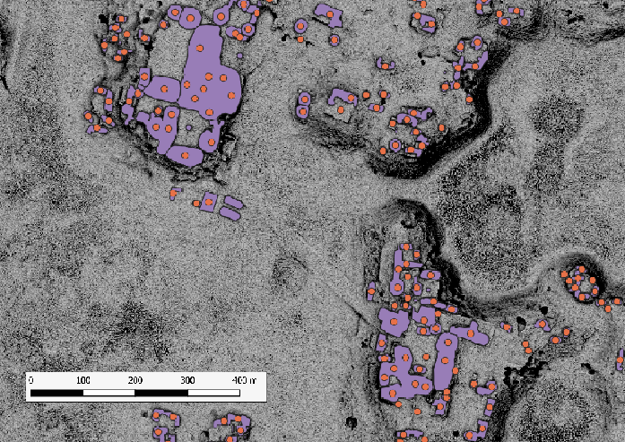

# Summit calculation

*If you already have observation points, this step isn't necessary.*

## Example of observation points created from a building polygon layer

## How can I obtain this ?

This step calculates observation points of buildings thanks to a DTM and a vector layer of buildings (point or/and polygon geometries).
1. <u>For a building **polygon** layer:</u>  Use the `Summit_calculation_from_polygon.py` script. You must install rasterio, fiona and shapely libraries, because this algorithm uses them (Users can easily install them thanks to anaconda)

Here is an example of setting up the python environment with conda in order to run the script :

2. <u>For a building **point** layer:</u>  Import the other two scripts in QGIS and use the `Local_summit_computing.py` QGIS plugin named "Local summit process around points" in the QGIS toolbox.

See how summit calculation works:
- [with a building polygon layer](../images/local_summit_process.png)
- [with a building point layer](../images/Summit_process.png)
